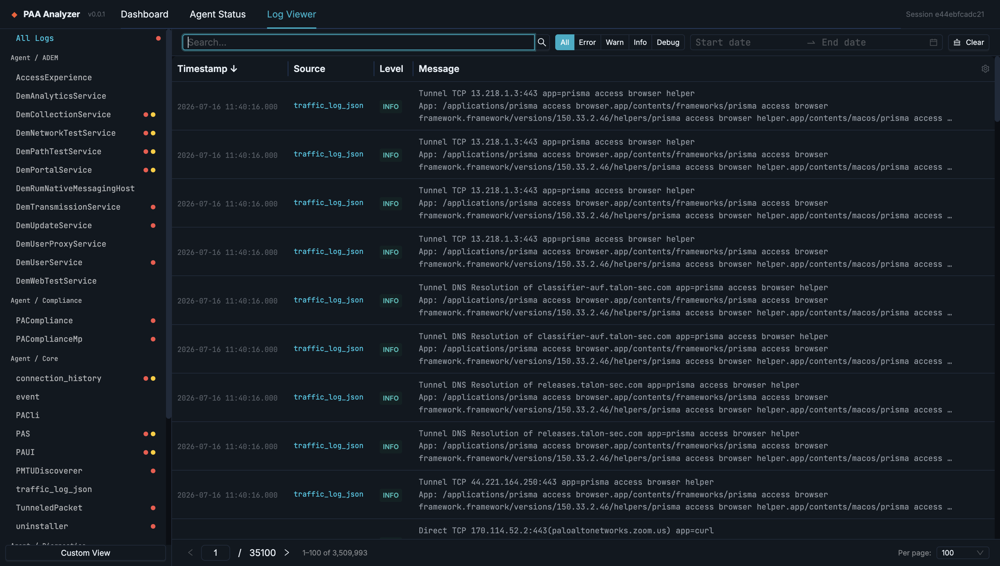
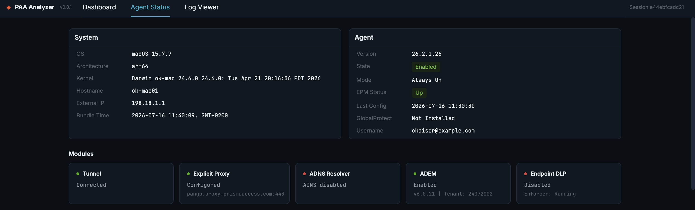
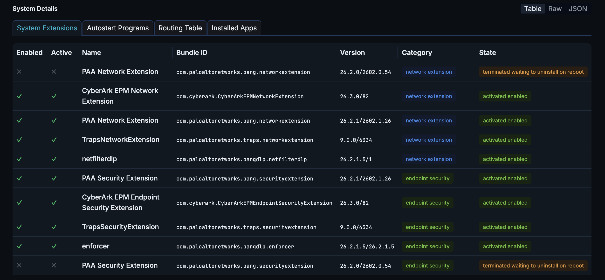
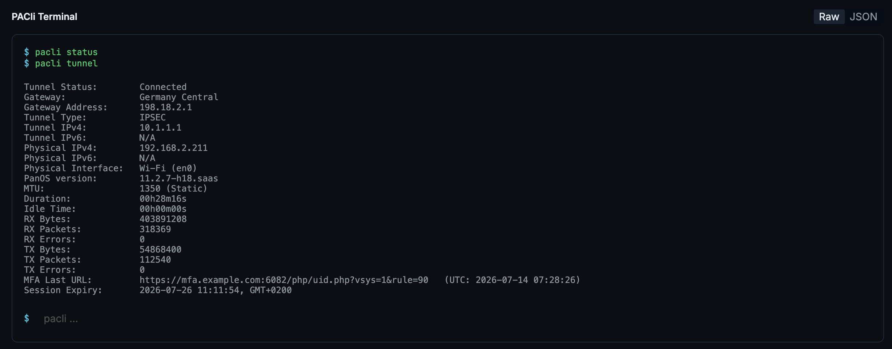

# PAA Analyzer

A full-stack diagnostic tool for analyzing **Prisma Access Agent** troubleshooting bundles. Upload a ZIP collected from a macOS or Windows endpoint, and instantly explore parsed logs, agent state, and system details through an interactive web UI.

## Features

- **Log Viewer**: filterable by source, level, date range, and search; resizable columns; expandable rows with raw/beautified JSON

- **Agent Status**: overview cards, module status badges, forwarding profile with hitcount links

- **System Details** -- OS-adaptive tabs (macOS: System Extensions, Launchctl; Windows: Firewall Rules, Installed Drivers, Network Config, Netstat)

- **PACli Terminal** -- interactive command replay with autocomplete

- **Multi-OS support** -- macOS and Windows troubleshooting bundles auto-detected


## Architecture

```
troubleshooting.zip
        |
        v
  +------------------+     +------------------+
  |  paa_analyzer/    |    |   backend/       |
  |  parsers.py       |--->|   pipeline.py    |
  |  parsers_win.py   |    |   store.py       |
  |  taxonomy.py      |    |   api/           |
  +------------------+     +------------------+
                                    |
                              REST API
                             /api/v1/*
                                    |
                                    v
                           +------------------+
                           |   frontend/      |
                           |   React + Antd   |
                           |   TanStack Query |
                           +------------------+
```

**Data flow:** Troubleshooting files are parsed by `paa_analyzer` into state (key-value snapshots) and log (time-series entries) categories. The backend stores state in Python dicts and logs in per-session SQLite `:memory:` databases with indexes for fast filtering. The frontend queries via TanStack Query hooks.

**Parser architecture:** Files are routed by `taxonomy.py` which maps filenames to `(data_type, module, component, parser)` tuples. The pipeline dispatches to parser functions in `parsers.py` (cross-platform) or `parsers_win.py` (Windows-specific). New file types are added by extending the taxonomy and writing a parser function.

## Getting Started

### Run with Docker (recommended)

The quickest way to run PAA Analyzer — you only need Docker. This builds a single
image containing both the frontend and backend and serves the whole app on one port:

```bash
docker compose up --build   # build the image and start the container
```

Then open <http://localhost:8000> in your browser. Stop it with `docker compose down`.

The container builds the React UI and runs the FastAPI backend, which serves both the
API and the built UI on port 8000 — no separate frontend server or second container
needed. The sections below run the app from source, mainly for development.

> **Note — picking up your changes in Docker.** `docker compose up` reuses the
> existing `paa-analyzer:latest` image and will keep serving the code as it was
> when that image was built. Pass `--build` to rebuild, or enable the development
> override for a hot-reload loop with no rebuilds at all:
>
> ```bash
> cp docker-compose.dev.yml docker-compose.override.yml   # once
> docker compose up                                       # from now on
> ```
>
> Compose merges `docker-compose.override.yml` automatically, so a plain
> `docker compose up` now bind-mounts `backend/` and `paa_analyzer/` into the
> container and runs uvicorn with `--reload` — saving a `.py` file restarts the
> server in about a second. The copy is gitignored, so it stays local to your
> checkout; `docker-compose.dev.yml` is the tracked template. Delete the copy to
> go back to the production configuration.
>
> This covers the **backend only**. The React UI is a static `vite build` baked
> into the image, so frontend changes still need `docker compose up --build` — or
> run `cd frontend && npm run dev` on the host (see [Development](#development)).

### Prerequisites

- Python 3.14 with [uv](https://docs.astral.sh/uv/)
- Node.js 18+

### Setup

```bash
# Clone and install backend
git clone <repo-url>
cd analyzer
uv sync --group dev

# Install frontend dependencies
cd frontend
npm install
cd ..

# Enable pre-commit hooks (lint + test gate)
git config core.hooksPath .githooks
```

### Development

```bash
# Start backend (port 8000, serves API + built frontend)
uv run paa-server

# In another terminal: start frontend dev server (hot reload, proxies /api to :8000)
cd frontend && npm run dev
```

Open http://localhost:5173 (dev server) or http://localhost:8000 (built frontend).

### CLI Usage

```bash
# Parse a troubleshooting ZIP to JSON files
uv run paa-parse examples/troubleshooting.zip output/

# Output structure:
# output/state/*.json   -- one file per state key
# output/logs/*.json    -- one file per log source
# output/manifest.json  -- parse summary
```

### Testing

```bash
# Backend tests (403 tests)
uv run pytest
uv run pytest --cov --cov-report=term-missing  # with coverage
uv run pytest -m "not slow"                     # skip e2e tests

# Frontend tests (65 tests)
cd frontend
npm test         # watch mode
npm run test:run # single run
```

### Building

```bash
cd frontend
npm run build  # runs tests, then tsc, then vite build -> dist/
```

The backend serves `frontend/dist/` as static files at `/`.

### Releasing

1. Bump version in `pyproject.toml` and `frontend/package.json`
2. Update `CHANGELOG.md`
3. Commit: `Release X.Y.Z`
4. Merge to main
5. Tag: `git tag -a vX.Y.Z -m "Release X.Y.Z"`

## Project Structure

```
analyzer/
  backend/
    api/             # FastAPI routers (sessions, logs, state, dashboard)
    models/          # Pydantic models
    pipeline.py      # ZIP -> parse -> store orchestration
    store.py         # In-memory session store with SQLite for logs
    tests/           # pytest test suite
  paa_analyzer/
    parsers.py       # Cross-platform parsers (27 functions)
    parsers_win.py   # Windows-specific parsers (19 functions)
    taxonomy.py      # File -> parser routing table
    cli.py           # paa-parse CLI tool
  frontend/
    src/
      api/           # Fetch client, TanStack Query hooks, TypeScript types
      components/    # React components (layout, log-viewer, agent-status, upload)
      hooks/         # useLogViewer, useUploadWithProgress
      pages/         # AgentStatusPage, DashboardPage
      test/          # Vitest setup, MSW handlers, test wrapper
  docs/
    architecture.md  # Architecture deep-dive (mkdocs site)
    index.md         # Docs site landing page
  .agents/
    context/         # Agent-facing technical docs (start at index.md)
  tools/
    context_docs.py  # Generator for the .agents/context/ inventory blocks
  CHANGELOG.md
  CLAUDE.md              # Claude Code instructions
  AGENTS.md              # Pointer to the agent context docs
```

## License

[MIT](LICENSE)
