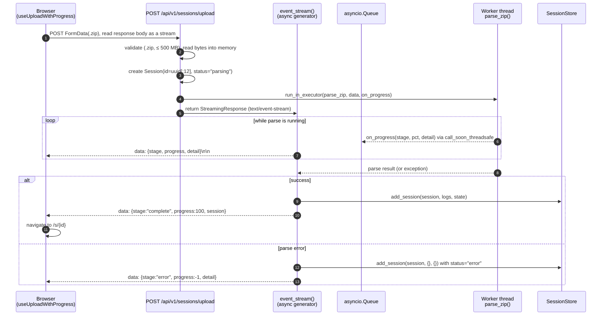
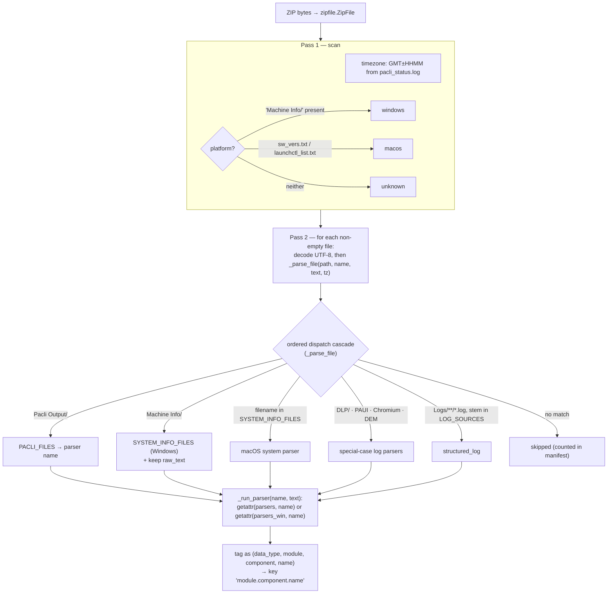
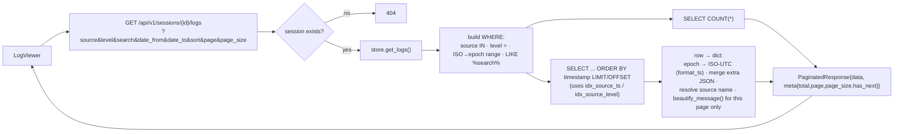

# Architecture

This page explains how PAA Analyzer is put together and how a troubleshooting
bundle travels from an uploaded `.zip` all the way to logs, state, and a dashboard
in the browser. It's written for a developer who is new to the codebase.

## Overview

PAA Analyzer turns a **Prisma Access Agent troubleshooting bundle** (a `.zip` of
logs and system files collected from a macOS or Windows endpoint) into a searchable,
normalized bundle for simplified troubleshooting analysis.

The whole system is one pipeline:

> **upload a zip → parse it → keep the result in memory → serve it over an API →
> show it in a React UI**

One design choice shapes everything else:

!!! warning "Nothing is persisted"
    There is **no database on disk**. Uploaded bytes are read into RAM, parsed, and
    the result is held by a single in-process `SessionStore` (per-session SQLite
    `:memory:` databases plus a few Python dicts). Restart the server — or just save
    a file, since the dev server runs with reload — and every session is gone.
    `settings.upload_dir` exists in config but nothing is ever written to it.

## Layers

The backend is a thin FastAPI application over a self-contained parser package. Data
flows top-to-bottom on the way in (parsing) and bottom-to-top on the way out
(serving).

```
┌─────────────────────────────────────────────────────────────────────┐
│  BROWSER  (React 19 + Vite + TanStack Query)                        │
│    UploadPage  ·  LogViewer  ·  DashboardPage  ·  AgentStatusPage   │
│    api/client.ts  →  fetch()  →  /api/v1/...                        │
└───────────────────────────────┬─────────────────────────────────────┘
                                │  HTTP + SSE (JSON)
┌───────────────────────────────▼─────────────────────────────────────┐
│  FastAPI APP   backend/main.py : create_app()                       │
│    Routers under /api/v1:  sessions · logs · state · dashboard      │
│    StaticFiles(frontend/dist) mounted at "/"  (API routes win first)│
└───────────────┬────────────────────────────────┬────────────────────┘
                │ upload → parse                 │ read (list / filter / fetch)
┌───────────────▼───────────────────────┐        │
│  PIPELINE  backend/pipeline.py        │        │
│    parse_zip(bytes, on_progress)      │        │
│    _parse_file()  routes each file    │        │
│    _run_parser()  dispatches by name  │        │
└───────────────┬───────────────────────┘        │
                │ uses                           │
┌───────────────▼────────────────────────────┐   │
│  PARSER PACKAGE   paa_analyzer/            │   │
│    taxonomy.py   file → parser registry    │   │
│    parsers.py    shared + macOS parsers    │   │
│    parsers_win.py  Windows parsers         │   │
│  backend entirely and writes JSON to disk) │   │
└───────────────┬────────────────────────────┘   │
                │ produces {state,logs,manifest} │
┌───────────────▼────────────────────────────────▼─────────────────────┐
│  SESSIONSTORE   backend/store.py  (module-level singleton `store`)   │
│    _sessions{}   session metadata (dict)                             │
│    _state{}      parsed state entries (dict)                         │
│    _log_meta{}   per-source metadata (dict)                          │
│    SQLite :memory:  one DB per session — the log rows live here      │
└──────────────────────────────────────────────────────────────────────┘
```

**Component responsibilities**

| Component | File | Job |
|-----------|------|-----|
| App factory | `backend/main.py` | Build the FastAPI app, mount the four routers under `/api/v1`, serve the built SPA from `frontend/dist`. |
| Sessions API | `backend/api/sessions.py` | Upload (streaming + plain), plus list/get/delete sessions. |
| Logs API | `backend/api/logs.py` | List log sources; run filtered, paginated log queries. |
| State API | `backend/api/state.py` | List/fetch parsed state keys; the computed `forwarding-profile` view. |
| Dashboard API | `backend/api/dashboard.py` | Summary counts (a v2 stub — reads numbers already on the session). |
| Pipeline | `backend/pipeline.py` | `parse_zip()`: zip bytes → `{state, logs, manifest}`. Routes and dispatches parsers. |
| Store | `backend/store.py` | The in-memory `SessionStore`: saves results and owns all query/filter/paginate logic. |
| Models | `backend/models/` | Pydantic `Session`, `LogSource`, and the `DataResponse` / `PaginatedResponse` envelopes. |
| Config | `backend/config.py` | Settings (`PAA_` env prefix): upload size limit, page sizes. |
| Parser engine | `paa_analyzer/parsers.py`, `parsers_win.py` | ~40 parsers turning raw file text into structured records. |
| Taxonomy | `paa_analyzer/taxonomy.py` | Declarative registry mapping filenames → which parser to run. |
| CLI | `paa_analyzer/cli.py` | `paa-parse <zip> [out/]` — parse straight to JSON files, no server. |

## Data Processing



## File Parsing

Inside `parse_zip`, each file in the bundle is routed to the right parser. This is
where platform differences and bundle layouts get handled.



Key ideas:

- **Platform detection is heuristic and bundle-wide** — it looks for `Machine Info/`
  (Windows) versus `sw_vers.txt`/`launchctl_list.txt` (macOS). The result is stored
  on the session as `platform`; individual files are still routed by their own
  path/name, so a slightly mixed bundle still parses file-by-file.
- **The taxonomy stores parser *names*, not functions.** `_run_parser` resolves a
  name with `getattr` on `parsers` and then `parsers_win`. An unknown name degrades
  gracefully to raw text rather than crashing.
- **Order matters.** The cascade is deliberately ordered (e.g. `Machine Info/` is
  checked before the macOS system-file table; Windows DEM before macOS DEM). The
  code comments call this out.
- **Results are keyed `module.component.name`** (e.g. `Agent.Networking.traffic_show`,
  `Agent.Core.PAS`). Rotated log files like `PAS.1.log`, `PAS.2.log` merge into one
  source, and entries are sorted by timestamp.

!!! tip "Timezone threading"
    Many bundle files have naive timestamps. Pass 1 extracts a single `GMT±HHMM`
    offset from `pacli_status.log` and threads it (`tz`) through every parser so
    naive times become correct UTC epochs.

## Datastore

`parse_zip` returns `{state, logs, manifest}`, and the endpoint calls
`store.add_session(...)`. The store is **hybrid** on purpose:

- **Logs → SQLite `:memory:`.** Each session gets its own in-memory SQLite database
  with a single `logs(source_key, timestamp, level, message, host, pid, extra)`
  table. Non-standard fields go into the JSON `extra` column. Rows are inserted in
  batches of 50,000, and the indexes (`source_key,timestamp` and `source_key,level`)
  are built *after* the bulk insert. The parsed entry lists are freed as they're
  inserted to keep peak memory down. Logs can be huge, and SQL is the cheapest way to
  filter, search, aggregate, and paginate them.
- **State + metadata → plain dicts.** `_state`, `_sessions`, and `_log_meta` are just
  Python dictionaries. State is small and usually fetched whole, so a database would
  be overkill.

The stored shapes (as produced by the parsers):

```
Session      id, filename, file_size, created_at, parse_status,
             parse_duration_ms, platform, total_log_entries,
             total_log_sources, total_state_files
Log entry    timestamp, level, message, [host, pid, + parser extras]
State entry  {_meta{type,module,component,source_file,name}, data, raw_text?}
```

## Frontend

Once a session is stored, the frontend navigates to `/s/{id}` and TanStack Query
hooks read it back over the API. The log query is the busiest path:



Other read endpoints follow the same request → store → envelope shape:

- `GET /sessions/{id}/logs/sources` — one `GROUP BY source_key, level` produces per-source
  totals, level histograms, and time ranges (`LogSource[]`).
- `GET /sessions/{id}/state`, `.../state/batch?keys=...`, `.../state/{key}` — dict lookups
  over `_state`.
- `GET /sessions/{id}/state/forwarding-profile` — a **computed** view that crosses the
  log/state divide: it takes the `traffic_show` rules from state and enriches each with
  hit counts by regex-scanning `traffic_log_json` entries for `"Rule priority N matched"`.
- `GET /sessions/{id}/dashboard` — counts straight off the session record.

**Frontend routes** (`App.tsx`): `/` upload, `/s/:id` log viewer, `/s/:id/dashboard`,
`/s/:id/agent-status`. In production one uvicorn process serves both the API and the
built SPA; in development Vite serves the UI and proxies `/api` to port 8000.
